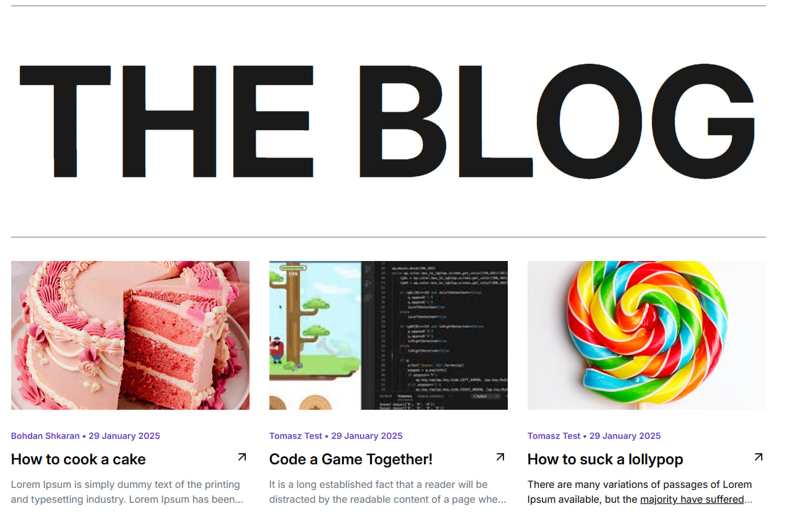

## Hi, Developer!

Backend uses:
 - Nest.js
 - PosgteSQL (Docker)
 - TypeORM

Front uses:
 - React.js + TypeScript
 - Tanstack Router + Query
 - Axios
 - Tailwind
 - Zustand
 - React Hook Form



## Backend setup:

! Copy **.env.example** to **.env.development**

```bash
# install packages
$ npm install

# compose db container (docker)
$ npm run start:db

# run app
$ npm run start:dev
```

## Frontend setup:

! Copy **.env.example** to **.env**

```bash
# install packages
$ npm install

# run app
$ npm run dev
```

## Stay in touch

- Author - [Bohdan Shkaran](https://www.linkedin.com/in/bogdan-shkaran/)

